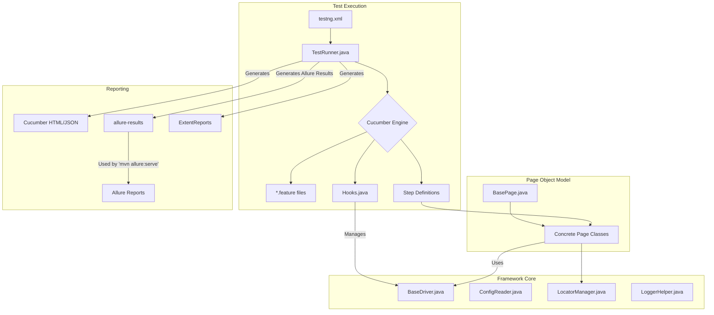

# Test Automation Framework: Knowledge Transfer Document

## 1. Introduction

### 1.1. Purpose

This document provides a comprehensive overview of the TheTrybe Web Automation Framework. It is designed to serve as a complete guide for new testers, enabling them to understand the framework's architecture, components, and workflows.

### 1.2. Framework Overview

This is a robust and scalable test automation framework built on a modern Java-based technology stack. It is designed to test the TheTrybe web application using a BDD (Behavior-Driven Development) approach, which ensures that the tests are readable and maintainable.

### 1.3. Key Technologies

- **Selenium WebDriver**: For browser automation.
- **TestNG**: As the test runner.
- **Cucumber**: For BDD implementation.
- **Maven**: For dependency management and build automation.
- **Allure**: For rich and detailed test reporting.
- **Log4j2**: For logging.
- **ExtentReports**: For enhanced and detailed HTML test reporting.

## 2. Framework Architecture

### 2.1. Project Structure and Key Features

The project follows a standard Maven project structure, with a clear separation of concerns. Below is a detailed breakdown of each key folder.

```
TheTrybeWebAutomation/
├── pom.xml
├── allure-results/
├── src/
│   ├── main/
│   │   ├── java/
│   │   │   ├── framework/
│   │   │   ├── pages/
│   │   └── resources/
│   │       ├── locators/
│   └── test/
│       ├── java/
│       │   ├── hooks/
│       │   ├── listeners/
│       │   ├── runners/
│       │   └── stepDefinitions/
│       └── resources/
│           └── features/
├── logs/
├── screenshots/
└── testng.xml
```

- **`pom.xml`**: The heart of the Maven project. It defines project dependencies, build plugins, and project metadata.
- **`allure-results/`**: This directory is automatically generated during the test run. It stores the raw JSON and attachment files that Allure uses to build the final HTML report.
- **`src/main/java/framework`**: Contains the core framework classes that provide foundational functionalities.
    - **Key Feature**: This folder isolates the framework's engine (driver management, config reading, locator handling) from the test logic.
- **`src/main/java/pages`**: Contains the Page Object Model (POM) classes.
    - **Key Feature**: Each class represents a page in the application, encapsulating its elements and user interactions to improve code reusability and maintainability.
- **`src/main/resources`**: Holds all non-Java files required for the main source code, such as configuration and locator files.
    - **Key Feature**: Separates configuration and data from the compiled code.
- **`src/main/resources/locators`**: Contains JSON files where element locators are stored.
    - **Key Feature**: Decouples locators from the test code, making them easier to update without modifying the test logic.
- **`src/test/java/stepDefinitions`**: The glue between feature files and the application code.
    - **Key Feature**: These classes contain the Java methods that execute for each Gherkin step, translating business-readable steps into actions.
- **`src/test/java/hooks`**: Manages the test lifecycle.
    - **Key Feature**: Uses `@Before` and `@After` annotations to define setup and teardown logic for each scenario, such as launching and closing the browser.
- **`src/test/java/runners`**: Contains the TestNG test runner class.
    - **Key Feature**: Configures and executes the Cucumber scenarios, generating reports and enabling parallel execution.
- **`src/test/java/listeners`**: Includes TestNG listeners that react to test events.
    - **Key Feature**: Provides the ability to perform actions on test failure, such as taking a screenshot, enhancing debugging capabilities.
- **`src/test/resources/features`**: Contains the `.feature` files written in Gherkin.
    - **Key Feature**: Describes the application's behavior in a human-readable format, making the tests accessible to non-technical stakeholders.
- **`logs/`**: Contains log files generated by Log4j2 during test execution.
    - **Key Feature**: Provides a detailed trace of test execution for debugging purposes.
- **`screenshots/`**: Stores screenshots taken during test execution.
    - **Key Feature**: Captures the state of the application at the moment of failure, providing a visual aid for debugging.
- **`testng.xml`**: The TestNG suite XML file.
    - **Key Feature**: Defines the test suite, allowing for flexible configuration of test execution, including listeners and parallel execution settings.

### 2.2. Architectural Diagram



## 3. Core Framework Components

The `src/main/java/framework` package contains the core components of the framework.

### 3.1. `BaseDriver.java`

- **Purpose**: Manages the `WebDriver` lifecycle.
- **Key Features**:
  - Uses `ThreadLocal` to ensure thread-safe parallel execution.
  - Automatically initializes a maximized `ChromeDriver` using Selenium Manager.
  - Provides static methods to get and quit the driver instance.

### 3.2. `ConfigReader.java`

- **Purpose**: Manages environment-specific configurations.
- **Key Features**:
  - Loads properties from `config.staging.properties` or `config.prod.properties` based on the `env` system property.
  - Defaults to `staging` if no environment is specified.
  - Provides a static `get()` method to retrieve configuration values.

### 3.3. `LocatorManager.java`

- **Purpose**: Manages and provides element locators.
- **Key Features**:
  - Externalizes locators into JSON files (e.g., `home.json`), which promotes maintainability.
  - Dynamically constructs `By` objects from the JSON files.
  - Caches locators to optimize performance.

## 4. Page Object Model (POM)

The framework follows the Page Object Model (POM) design pattern, which enhances test maintenance and reduces code duplication.

### 4.1. `BasePage.java`

- **Purpose**: Serves as the foundation for all page objects.
- **Key Features**:
  - Initializes the `WebDriver` and `WebDriverWait`.
  - Provides robust, reusable methods for common interactions like `click`, `sendKeys`, and waits.
  - Includes a `StaleElementReferenceException` handler and a `jsClick` workaround for common Selenium challenges.

### 4.2. Concrete Page Classes (e.g., `HomePage.java`)

- **Purpose**: Encapsulate the locators and functionalities of a specific page.
- **Implementation**:
  - Inherit from `BasePage`.
  - Fetch locators from `LocatorManager`.
  - Define methods that correspond to user interactions on the page.

## 5. BDD Workflow

The framework uses Cucumber to implement BDD, ensuring a clear connection between business requirements and test implementation.

```mermaid
flowchart LR
    A[Feature File (*.feature)] -- Defines --> B(Scenario)
    B -- Composed of --> C{Steps (Given, When, Then)}
    C -- Implemented by --> D[Step Definition Methods]
    D -- Interact with --> E[Page Objects]
```

### 5.1. Feature Files

- **Location**: `src/test/resources/features`
- **Purpose**: Define test scenarios in a human-readable Gherkin format.
- **Tags**: Use tags (e.g., `@smoke`, `@regression`) to categorize and filter tests.

### 5.2. Step Definitions

- **Location**: `src/test/java/stepDefinitions`
- **Purpose**: Contain the Java methods that implement the steps defined in the feature files.
- **Implementation**:
  - Initialize the required page objects.
  - Call page object methods to execute the test.
  - Use `Assert` to validate test outcomes.

### 5.3. `Hooks.java`

- **Location**: `src/test/java/hooks`
- **Purpose**: Manages the test lifecycle.
- **Key Features**:
  - **`@Before`**: Ensures a new `WebDriver` instance is created for each scenario.
  - **`@After`**: Handles cleanup and takes a screenshot on failure.

## 6. Test Execution and Reporting

### 6.1. Test Execution

- **`TestRunner.java`**: Configures and runs the Cucumber tests with TestNG.
- **`testng.xml`**: Defines the test suite, including the test runner and listeners.
- **Running Tests**:
  - **From IDE**: Right-click on `testng.xml` and select "Run".
  - **From CLI**: Use Maven: `mvn clean test`
  - **Filtering by Tags**: `mvn clean test -Dcucumber.filter.tags="@smoke"`

### 6.2. Reporting

The framework is configured to generate three types of reports, providing comprehensive insights into test execution.

#### 6.2.1. ExtentReports (Primary)

- **Description**: A modern, interactive, and highly detailed HTML report. It is the primary reporting tool for this framework, offering a dashboard view, test categorization, and step-level details with screenshots.
- **Configuration**: Managed by `com.aventstack.extentreports.cucumber.adapter.ExtentCucumberAdapter` in `TestRunner.java` and configured via `src/test/resources/extent.properties`.
- **Location**: The report is generated in a timestamped folder to preserve the history of each run.
  - **Path**: `test-output/yyyy-MM-dd_HH-mm-ss/index.html`

#### How to View the ExtentReport
After running the tests (`mvn clean test`), navigate to the `test-output` directory. Open the latest timestamped folder and open the `index.html` file in your browser.

#### 6.2.2. Allure Report

- **Description**: Another powerful, interactive report that provides a comprehensive overview of test results, including steps, attachments, timings, and historical data.
- **Configuration**: The framework is configured to generate Allure results via the `io.qameta.allure.cucumber7jvm.AllureCucumber7Jvm` plugin in `TestRunner.java`.

#### How to Generate and View the Allure Report

Generating the Allure report is a two-step process.

**Step 1: Run the Tests to Generate Allure Results**

During the test run, Allure creates a directory named `allure-results` in the project's root folder, populated with raw test result files (in JSON format) and any attachments.

```bash
mvn clean test
```

**Step 2: Generate and Serve the HTML Report**

Once the `allure-results` directory is populated, generate and open the HTML report using the Allure Maven plugin.

```bash
mvn allure:serve
```

This command starts a local web server and automatically opens the Allure report in your default web browser.

**To stop the server, press `Ctrl+C` in the terminal.**

#### 6.2.3. Cucumber HTML Report (Basic)
- **Description**: A basic HTML report generated by Cucumber. Useful for a quick, straightforward overview.
- **Location**: `target/cucumber-report.html`.

### 6.3. Parallel Execution

This framework is designed to support parallel execution to significantly reduce test run time. By default, it is turned off. Here’s how to enable and configure it.

#### How to Enable Parallel Execution

Parallel execution is managed at two levels:

1.  **TestNG Suite (`testng.xml`)**: Controls how TestNG runs tests in parallel.
2.  **Cucumber DataProvider (`TestRunner.java`)**: Controls whether Cucumber scenarios run in parallel.

For this framework, you need to enable both.

**Step 1: Update `TestRunner.java`**

To allow Cucumber scenarios to run in parallel, you need to modify the `@DataProvider` annotation in `src/test/java/runners/TestRunner.java`.

-   **File**: `src/test/java/runners/TestRunner.java`
-   **Change**: Set the `parallel` attribute to `true`.

***Before:***
```java
@Override
@DataProvider(parallel = false)
public Object[][] scenarios() {
    return super.scenarios();
}
```

***After:***
```java
@Override
@DataProvider(parallel = true)
public Object[][] scenarios() {
    return super.scenarios();
}
```

**Step 2: Update `testng.xml`**

Next, configure the TestNG suite to run tests in parallel.

-   **File**: `testng.xml`
-   **Change**: Modify the `parallel` and `thread-count` attributes of the `<suite>` tag.

***Before:***
```xml
<suite name="Cucumber Suite" parallel="none" thread-count="1">
```

***After (Example for 4 parallel threads):***
```xml
<suite name="Cucumber Suite" parallel="methods" thread-count="4">
```

**Parallel Modes in `testng.xml`:**

-   `parallel="methods"`: Runs individual test methods in parallel. Since each Cucumber scenario is treated as a method by the `TestRunner`, this is the recommended setting for scenario-level parallelism.
-   `parallel="tests"`: Runs all `<test>` tags in your `testng.xml` in parallel.
-   `parallel="classes"`: Runs all test classes in parallel.

**Important Considerations:**

-   **Thread Safety**: The framework is thread-safe because it uses `ThreadLocal` for the `WebDriver` instance in `BaseDriver.java`. Each thread gets its own isolated browser instance.
-   **Thread Count**: The `thread-count` should be adjusted based on the available system resources (CPU cores, memory). A good starting point is the number of CPU cores.
-   **Test Data**: Ensure your tests are independent and do not rely on a shared state or data that could cause conflicts during parallel execution.

## 7. Getting Started for New Testers

### 7.1. Prerequisites

- **Java Development Kit (JDK)**: Version 21 or higher.
- **Apache Maven**: For dependency management and building the project.
- **IDE**: IntelliJ IDEA or Eclipse.

### 7.2. Project Setup

1.  **Clone the Repository**: `git clone <repository_url>`
2.  **Open in IDE**: Open the project as a Maven project.
3.  **Build the Project**: `mvn clean install`

### 7.3. Running Tests

1.  **Run a Specific Test**: Right-click on `testng.xml` in your IDE and select "Run".
2.  **Run from Command Line**: `mvn clean test`

### 7.4. Adding a New Test Case

1.  **Create a New Feature File**: Add a new `.feature` file in `src/test/resources/features`.
2.  **Write the Scenario**: Define the test scenario using Gherkin syntax.
3.  **Implement Step Definitions**: Create a new step definition class or add the new steps to an existing one.
4.  **Create/Update Page Objects**: If necessary, create new page objects or update existing ones.
5.  **Add Locators**: Add new locators to the relevant JSON file in `src/main/resources/locators`.
6.  **Run the Test**: Run the new test to ensure it passes.